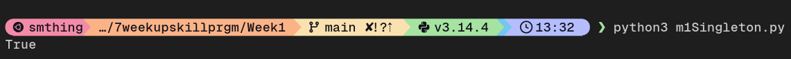
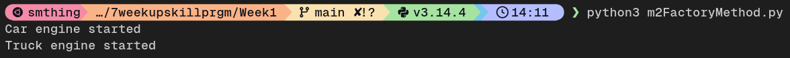
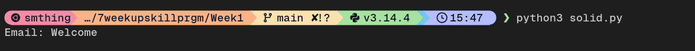
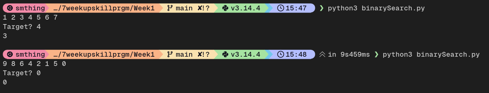
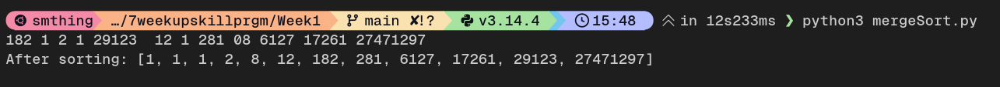

### M1

## Task 1 

# Exercise name: Implement Singleton Pattern in Python

Demonstrate the Singleton Design Pattern by ensuring that **only one** instance of a class can be created.

```
def __new__(cls):
    if cls._instance is None:  
        cls._instance = super().__new__(cls)
    return cls._instance
```

-> _instance is a class variable that stores the single object.

-> Initially _instance is None because no object exists yet.

-> cls refers to the class itself.

-> __new__() is overridden to control object creation.

-> If no instance exists, a new object is created and stored.

-> Otherwise, the existing object is returned.

# output



## Task 2

# Exercise name: Apply Factory Method Pattern — Vehicle Factory
Demonstrate the Factory Method Design Pattern using different vehicle types.

```
TruckFacto = TruckFactory()
truck = TruckFacto.create_vehicle()
truck.start()
```


-> VehicleFactory declares the factory method.

-> CarFactory creates Car objects.

-> BikeFactory creates Bike objects.

-> The client uses factories instead of creating vehicles directly.

-> New vehicle types can be added without changing existing code.

# output




## Task 3

# Exercise name: Refactor code to follow SOLID principles

Refactor the code to depend on abstractions instead of concrete implementations.

```
service = NotificationService(EmailSender())
service.notify("Welcome")
```

-> MessageSender defines a common interface for all senders.

-> EmailSender, SmsSender, and PushSender implement the interface.

-> NotificationService depends on the abstraction, not concrete classes.

-> New sender types can be added without modifying existing code.

-> Improves flexibility and maintainability.

# output



### M2


## Task 4

# Exercise name: Implement Binary Search
Find element in given sorted array.

```
while low<=high:
    mid = low + (high-low)//2
    if self.arr[mid] == target:
        return mid
```

-> Works only on sorted arrays.

->Middle element is checked in each iteration.

->If target is smaller, search continues in the left half else its in the right half.

-> Time complexity is O(log n).

# output



## Task 5

# Exercise name: Implement Merge Sort
Sort given array using merge sort

```
if L[i] < R[j]:
    arr[k] = L[i]
else:
    arr[k] = R[j]
```

-> The array is recursively divided into smaller subarrays.

-> Sorted subarrays are merged back together.

-> Merging compares elements from both halves.

-> Time complexity is O(n log n).

# output

