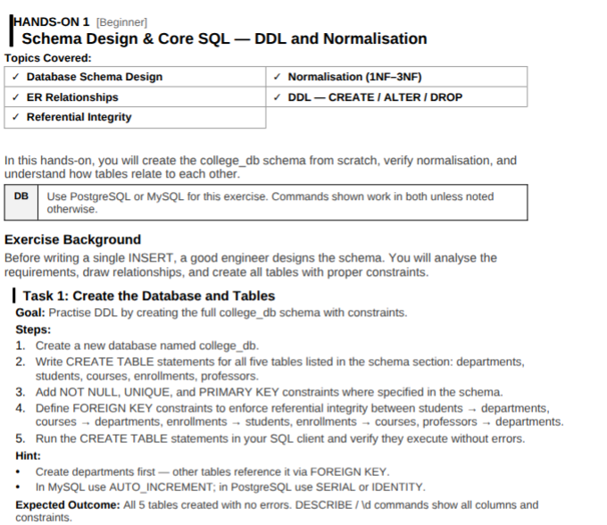
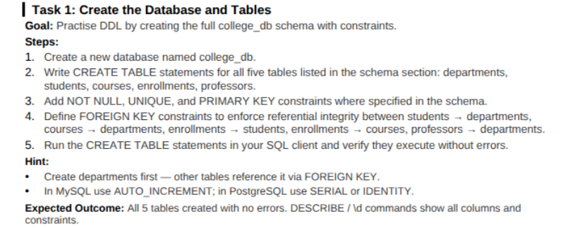
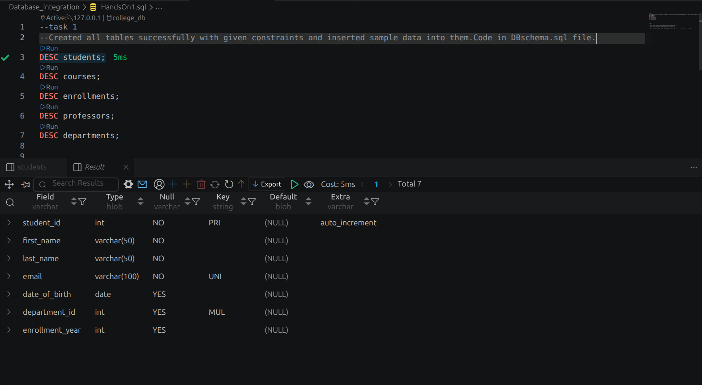
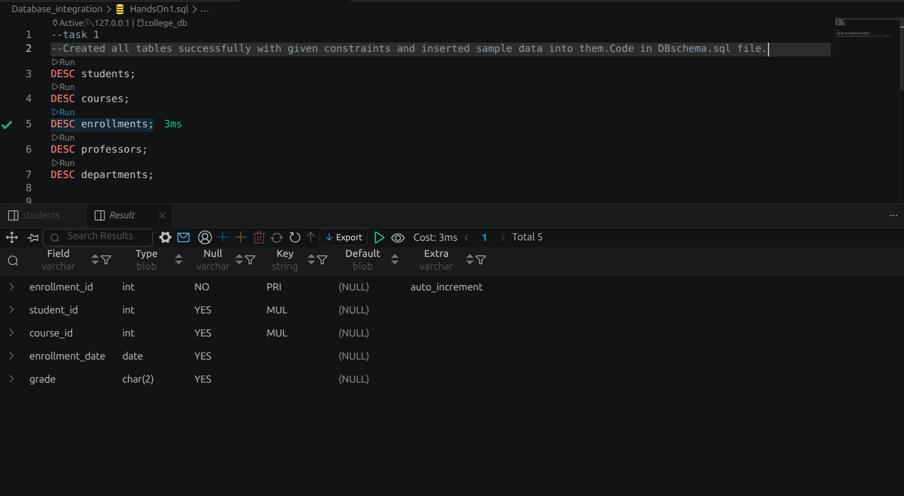
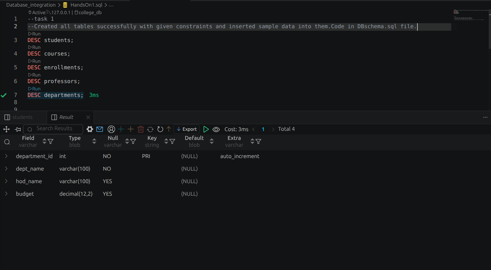
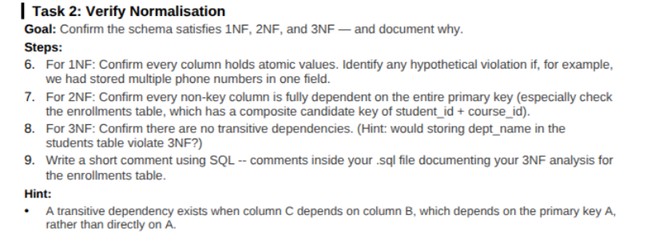
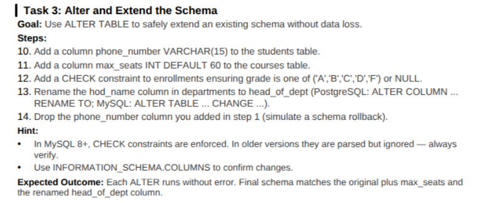
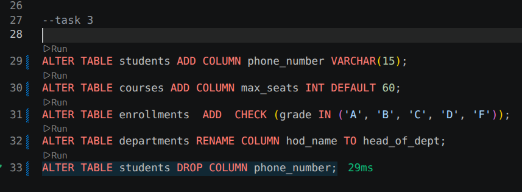

# Task 1

# Task 1 Outcome

students table

courses table

enrollments table

professors table

departments table

# Task 2

## Task 2 Documentation is in the SQL file

# Task 3 

## Task 3 Outcome

All ALTER commands executed successfully 

